# Funcionamento da IA — Projeto Smart

Relatório do fluxo completo da IA: cada passo e cada bifurcação a partir do momento em que
uma mensagem do usuário é recebida até a resposta final em streaming.

## 1. Visão geral

A IA é um **orquestrador** para cafeicultura. Para cada mensagem ele: (1) busca contexto no
**RAG**, (2) decide a **rota** (resposta direta, um agente, ou plano multiagente), (3) executa
os **agentes A2A** especializados — que por sua vez chamam **ferramentas MCP** sobre
InfluxDB/OpenWeather — e (4) gera a **resposta final** com um LLM, transmitida em streaming.

Há **dois pontos de entrada** com a mesma lógica de orquestração:

- **HTTP + SSE** — `POST /v1/ai/chat` → `AiService.streamPrimaryChat` (sem estado).
- **WebSocket** — Durable Object `SmartAgent` (Agents SDK) → `handleChat`, com sessão
  autenticada e **histórico persistente** (até 20 mensagens).

## 2. Componentes

| Arquivo                                                  | Responsabilidade                                                                   |
| -------------------------------------------------------- | ---------------------------------------------------------------------------------- |
| `apps/api/src/features/ai/ai.routes.ts`                  | Endpoint `POST /v1/ai/chat`: valida header/JSON, `authMiddleware`, responde SSE.   |
| `apps/api/src/features/ai/ai.vo.ts`                      | Schema Zod do payload (`messages[]`, `conversationId?`, `model?`).                 |
| `apps/api/src/features/ai/ai.models.ts`                  | Registro de LLMs selecionáveis; default e `resolveModelId()`.                      |
| `apps/api/src/features/ai/ai.service.ts`                 | Caminho HTTP/SSE: monta o `ReadableStream` e emite eventos.                        |
| `apps/api/src/features/ai/ai.agent.ts`                   | Caminho WebSocket (`SmartAgent` DO): auth, histórico, `chat`/`clear`.              |
| `apps/api/src/features/ai/ai.orchestrate.ts`             | Núcleo: RAG, roteamento, execução de agentes, fallbacks, parsing do stream, trace. |
| `apps/api/src/features/ai/ai.type.ts`                    | Contratos (rotas, status, evidence, trace).                                        |
| `apps/api/src/features/a2a/*/<agente>.agent.ts`          | Agentes A2A (ar, chuva, raio, radiacao, solo, vento).                              |
| `apps/api/src/features/mcp/mcp.environmental-tools.ts`   | Ferramentas MCP `smart_*` (InfluxDB medido / OpenWeather externo+previsão).        |
| `apps/front/src/features/dashboard/dashboard.service.ts` | Consumo no front: `streamPrimaryAiChat` (SSE) e `processAgentMessage` (WS).        |

## 3. Diagrama do fluxo (passo a passo, com todas as bifurcações)

```text
                        ┌─────────────────────────────┐
                        │  Usuário envia mensagem     │
                        └──────────────┬──────────────┘
                                       │
                    ┌──────────────────┴──────────────────┐
                    │ qual ponto de entrada?              │
                    ▼                                     ▼
        ┌────────────────────────┐           ┌──────────────────────────────┐
        │ HTTP  POST /v1/ai/chat │           │ WebSocket  SmartAgent (DO)   │
        │ ai.routes.ts           │           │ ai.agent.ts                  │
        └───────────┬────────────┘           └───────────────┬──────────────┘
                    │                                        │
         [validação header/JSON]                   [onConnect: sessão?]
                    │                                        │
        ┌───────────┴───────────┐               ┌────────────┴─────────────┐
        │ Content-Type !=       │ inválido      │ sem sessão  → close 4001 │
        │ application/json  ───▶ 415            │ name != user.id          │
        │ JSON Zod inválido ───▶ 400            │  ou accountId divergente │
        │ válido ↓                              │      → close 4003        │
        └───────────┬───────────┘               │ ok ↓ (emite 'history')   │
                    │                           └─────────────┬────────────┘
              [authMiddleware]                    [onMessage: type?]
                    │                       ┌─────────────────┼─────────────────┐
            ┌───────┴───────┐               ▼                 ▼                 ▼
            │ não autenticado│           type='clear'    type='chat'      JSON inválido
            │     → 401      │           limpa histórico  ↓               → 'error'
            │ autenticado ↓  │           emite 'cleared'  buildContext
            └───────┬───────┘                            (mescla histórico ≤20)
                    │                                     │
                    └──────────────┬──────────────────────┘
                                   ▼
            ╔══════════════════════════════════════════════════════════╗
            ║  ORQUESTRAÇÃO (comum aos dois caminhos)                    ║
            ╚══════════════════════════════════════════════════════════╝
                                   │
                    ① RAG  getRagContext(env, payload)
                                   │
              ┌────────────────────┼────────────────────┐
              ▼                    ▼                     ▼
     SMART_RAG.search()    fallback ai.aiSearch()   ambos falham
     ok → chunks           ok → chunks              catch → sources:[]
              └────────────────────┼────────────────────┘
                                   ▼
                     hasRagContext = há chunks?
                     (status: "RAG retornou N fonte(s)" / "sem contexto")
                                   │
                    ② ROTA  runRoutingDecision(...)
                                   │
                     buildHeuristicDecision (palavras-chave)
                                   │
              ┌────────────────────┴─────────────────────┐
              │ heurística != 'direct' ?                  │
              ▼ sim                                       ▼ não (heurística='direct')
       usa heurística                            chama LLM Router (JSON, temp 0.1)
       direto (não chama LLM)                            │
              │                                  normalizeDecision(parsed, fallback)
              │                          ┌────────────────┼─────────────────┐
              │                          ▼ válida          ▼ erro/JSON ruim/
              │                       usa decisão          eletricidade/
              │                       do LLM               multi vazio
              │                          │             → fallback heurística
              └──────────────┬───────────┴─────────────────┘
                             ▼
                  route ∈ { direct | agent | multi-agent }
                             │
        ┌────────────────────┼─────────────────────────────────┐
        ▼ direct             ▼ agent                            ▼ multi-agent
   nenhum agente       1 chamada de agente              N chamadas de agente
   (status: "rota      (selectedAgent)                  (calls[])
    direta")                │                                  │
        │                   └─────────────┬────────────────────┘
        │                                 ▼
        │                  ③ executeAgentPlan → para cada call:
        │                                 │
        │                  ┌──────────────┴───────────────┐
        │                  ▼ sem handler                  ▼ com handler
        │            agentId='eletricidade'        chama <agente>.agent.ts
        │            → status 'failed'                    │
        │            (resposta direta)         ┌──────────┴───────────┐
        │                                      ▼ falta 'group' etc.   ▼ params ok
        │                                  input-required          chama MCP tool
        │                                                          smart_*(...)
        │                                                              │
        │                                              ┌───────────────┴──────────────┐
        │                                              ▼ InfluxDB (medido)   ▼ OpenWeather
        │                                              Teros12/Atmos41        (externo/forecast)
        │                                                          │
        │                                          dado medido ausente
        │                                          e candidato elegível?
        │                                          (isMeasuredFallbackCandidate)
        │                                              │ sim
        │                                       fallback temporal:
        │                                       re-tenta janela -24h, depois -7d
        │                                              │
        │                                       monta evidence + status
        │                                       (completed | input-required | failed)
        └────────────────────┬─────────────────────────┘
                             ▼
              ④ emite 'trace'  (buildTracePayload)
                             │
              monta finalMessages (com RAG) e baseMessages (sem RAG)
              modelId = resolveModelId(payload.model)  → default se inválido
                             │
              ⑤ LLM FINAL  runPrimaryModelStream — cascata (1ª que stremar vence):
                 ┌─────────────────────────────────────────────────────┐
                 │ (se hasRagContext) unified  modelo+RAG               │
                 │                    unified  modelo+base              │
                 │ (se hasRagContext) workers-ai gateway+RAG            │
                 │ (se hasRagContext) workers-ai direto+RAG             │
                 │                    workers-ai gateway+base           │
                 │                    workers-ai direto+base            │
                 │ todas falharam → throw → evento 'error'              │
                 └─────────────────────────────────────────────────────┘
                             │
              emite 'start' (model, route, selectedAgent, rag)
                             │
              ⑥ STREAMING: lê upstream, separa blocos por "\n\n",
                 processUpstreamBlock → emite 'delta' por trecho
                             │
              ┌──────────────┴──────────────┐
              ▼ chegou [DONE]/fim            ▼ exceção em qualquer ponto
        emite 'done'                    emite 'error' { message }
        (response, trace, route,        e encerra o stream
         agentResults, rag)
              │ (WebSocket) saveConversation(histórico + resposta)
              ▼
           Fim
```

### 3.1. Diagrama Mermaid (mesmo fluxo)

```mermaid
flowchart TD
    Start([Usuário envia mensagem]) --> Entry{Ponto de entrada}

    Entry -->|HTTP| Http["POST /v1/ai/chat<br/>ai.routes.ts"]
    Entry -->|WebSocket| Ws["SmartAgent (DO)<br/>ai.agent.ts"]

    %% Caminho HTTP
    Http --> HttpValid{"Header + JSON Zod válidos?"}
    HttpValid -->|Content-Type inválido| E415[/"415"/]
    HttpValid -->|JSON inválido| E400[/"400"/]
    HttpValid -->|ok| HttpAuth{authMiddleware autenticado?}
    HttpAuth -->|não| E401[/"401"/]
    HttpAuth -->|sim| Orchestrate

    %% Caminho WebSocket
    Ws --> WsConn{"onConnect: sessão válida?"}
    WsConn -->|sem sessão| C4001[/"close 4001"/]
    WsConn -->|name/accountId divergente| C4003[/"close 4003"/]
    WsConn -->|ok, emite history| WsMsg{"onMessage: type?"}
    WsMsg -->|clear| Cleared["limpa histórico → 'cleared'"]
    WsMsg -->|JSON inválido| WsErr["evento 'error'"]
    WsMsg -->|chat| WsCtx["buildContextPayload<br/>(mescla histórico ≤20)"]
    WsCtx --> Orchestrate

    %% Orquestração comum
    subgraph Orchestrate ["Orquestração (comum aos dois caminhos)"]
        direction TB
        Rag["① RAG getRagContext"] --> RagBranch{"SMART_RAG.search ok?"}
        RagBranch -->|sim| HasRag
        RagBranch -->|falha → fallback ai.aiSearch| RagFb{"fallback ok?"}
        RagFb -->|sim| HasRag
        RagFb -->|não| RagEmpty["sources: [] (sem contexto)"]
        RagEmpty --> HasRag["hasRagContext = há chunks?"]

        HasRag --> Route["② runRoutingDecision"]
        Route --> Heur["buildHeuristicDecision (palavras-chave)"]
        Heur --> HeurBranch{"heurística != 'direct'?"}
        HeurBranch -->|sim| Decision["route ∈ {direct, agent, multi-agent}"]
        HeurBranch -->|não| Llm["LLM Router (JSON, temp 0.1)"]
        Llm --> Norm{"normalizeDecision válida?"}
        Norm -->|sim| Decision
        Norm -->|"erro / JSON ruim / eletricidade / multi vazio"| Decision

        Decision --> RDirect{"qual rota?"}
        RDirect -->|direct| NoAgent["nenhum agente"]
        RDirect -->|agent| OneAgent["1 chamada (selectedAgent)"]
        RDirect -->|multi-agent| ManyAgent["N chamadas (calls[])"]

        OneAgent --> Exec["③ executeAgentPlan (por call)"]
        ManyAgent --> Exec
        Exec --> Handler{"handler existe?"}
        Handler -->|"não (eletricidade)"| Failed["status 'failed' → resposta direta"]
        Handler -->|sim| Params{"params suficientes?"}
        Params -->|"falta group, etc."| InputReq["input-required"]
        Params -->|ok| Mcp["chama MCP smart_*"]
        Mcp --> Source{"fonte de dados"}
        Source -->|medido| Influx["InfluxDB (Teros12/Atmos41)"]
        Source -->|externo/previsão| Ow["OpenWeather"]
        Influx --> FbCheck{"dado medido ausente<br/>e candidato elegível?"}
        Ow --> FbCheck
        FbCheck -->|sim| FbTemporal["fallback temporal: -24h, depois -7d"]
        FbCheck -->|não| Evidence["monta evidence + status"]
        FbTemporal --> Evidence

        NoAgent --> Trace["④ emite 'trace'"]
        Failed --> Trace
        InputReq --> Trace
        Evidence --> Trace

        Trace --> Msgs["finalMessages (com RAG) + baseMessages (sem RAG)<br/>resolveModelId(model)"]
        Msgs --> Final["⑤ runPrimaryModelStream — cascata"]
        Final --> FinalBranch{"alguma tentativa stremou?"}
        FinalBranch -->|"não (todas falharam)"| FinalErr["evento 'error'"]
        FinalBranch -->|sim| StartEv["emite 'start'"]
        StartEv --> Stream["⑥ STREAMING: processUpstreamBlock → 'delta'"]
        Stream --> StreamBranch{"resultado do stream"}
    end

    StreamBranch -->|"[DONE] / fim"| Done["emite 'done'<br/>(WS: saveConversation)"]
    StreamBranch -->|exceção| StreamErr["emite 'error'"]
    Done --> End([Fim])
    StreamErr --> End
    FinalErr --> End
```



## 4. Detalhe das bifurcações

1. **Entrada** — `AiService.streamPrimaryChat` (HTTP/SSE, sem estado) **ou** `SmartAgent`
   (WebSocket/Durable Object, com histórico). Lógica de orquestração idêntica.
2. **Auth** — HTTP: `authMiddleware` (401 se não autenticado). WS: `onConnect`
   (`ai.agent.ts:35`) fecha `4001` sem sessão, `4003` se `name !== session.user.id` ou
   `accountId` divergente; ao conectar emite `history`.
3. **Validação** — Zod `AiChatInboundSchema` (`ai.vo.ts`): `messages` ≥ 1, `content` ≥ 1,
   `model` opcional dentro do enum. HTTP → 415/400; WS → `error` "Formato de mensagem invalido".
4. **RAG** (`getRagContext`, `ai.orchestrate.ts:248`) — primário `env.SMART_RAG.search()`;
   em erro, fallback `env.ai.aiSearch().get('smart-rag').search()`; se ambos falharem,
   `{ contextMessage: null, sources: [] }`. Máx. 2 chunks, 900 chars/chunk. A presença de
   chunks define `hasRagContext` e muda a mensagem de status.
5. **Roteamento** (`runRoutingDecision`, `ai.orchestrate.ts:1083`):
    - `buildHeuristicDecision` roda primeiro (palavras-chave → `inferAgentCalls`). Se ela já
      resultar em `agent`/`multi-agent`, **é usada direto** e o LLM router **não** é chamado.
    - Se a heurística der `direct`, chama o **LLM router** (`json_object`, `temperature 0.1`)
      e passa por `normalizeDecision`. Volta para a heurística se: JSON inválido, exceção,
      `route='agent'` sem `selectedAgent`, qualquer call de `eletricidade`, ou `multi-agent`
      com `calls` vazio.
    - Saída: `route ∈ {direct, agent, multi-agent}`.
6. **Execução de agentes** (`executeAgentPlan`/`executeAgentCall`, `ai.orchestrate.ts:1690`):
    - `direct` → nenhum agente (`[]`).
    - **`eletricidade`** não tem handler em `AGENT_HANDLER_MAP` (`ai.orchestrate.ts:1184`)
      → `status: 'failed'`, orquestrador responde diretamente.
    - Handler presente → estado da Task vira `completed` | `input-required` | `failed`.
      `input-required` ocorre quando faltam parâmetros (ex.: `group` no agente Solo).
    - **Fallback temporal**: se a resposta indica ausência de série medida
      (`indicatesMissingMeasuredData`) e a call é elegível (`isMeasuredFallbackCandidate`),
      re-tenta janelas maiores `-24h` e depois `-7d` (`fallbackDataWindows`).
    - Cada agente chama uma tool MCP `smart_*` e produz `evidence` (provider, MCP tool,
      valores, timestamps).
7. **Mensagens finais** (`buildFinalMessages`) — gera duas versões: `finalMessages` (inclui o
   bloco RAG) e `baseMessages` (sem RAG), para permitir a cascata de fallback do LLM.
8. **LLM final** (`runPrimaryModelStream`, `ai.orchestrate.ts:407`) — tenta em ordem:
   `unified+rag` → `unified+base` → `workers-ai gateway+rag` → `workers-ai direto+rag` →
   `workers-ai gateway+base` → `workers-ai direto+base`. As variantes `+rag` só entram na
   lista quando `hasRagContext`. A primeira tentativa que retornar um stream vence; se todas
   falharem, lança erro → evento `error`. `unified` = OpenRouter via AI Gateway (modelo
   escolhido); `workers-ai` = `@cf/qwen/qwen3-30b-a3b-fp8` (resiliência).
9. **Streaming** (`processUpstreamBlock`) — blocos SSE upstream separados por `\n\n`; cada
   delta vira evento `delta`. `[DONE]` ou fim do stream → evento `done` (com `trace`, `route`,
   `agentResults`, `rag`). Qualquer exceção → evento `error`. No WebSocket, ao concluir,
   `saveConversation` persiste o histórico (≤ 20 mensagens).

## 5. Catálogo de agentes

| Agente           | Domínio                                                     | Tem A2A?                                          |
| ---------------- | ----------------------------------------------------------- | ------------------------------------------------- |
| **ar**           | Temperatura/umidade do ar, pressão, condições climáticas    | Sim                                               |
| **chuva**        | Chuva, precipitação, previsão, risco de temporal            | Sim                                               |
| **radiacao**     | Radiação solar, UV, insolação, luminosidade                 | Sim                                               |
| **raio**         | Descargas atmosféricas, risco elétrico por raios            | Sim                                               |
| **solo**         | Umidade/temperatura/condutividade do solo (Teros12), manejo | Sim                                               |
| **vento**        | Vento, rajadas, pulverização, deriva                        | Sim                                               |
| **eletricidade** | Energia, bombas, consumo, equipamentos                      | **Não** — sem handler A2A; cai em resposta direta |

Catálogo de domínios e gatilhos: `AGENT_CATALOG` em `ai.orchestrate.ts:67`.

## 6. Eventos emitidos

Mesmos eventos nos dois caminhos (no SSE como `event:`; no WS como `{ type, data }`):

| Evento   | Quando                                                                                             |
| -------- | -------------------------------------------------------------------------------------------------- |
| `status` | Progresso por fase (`thinking` → `agent-calling` → `responding`), com `state` `active`/`complete`. |
| `trace`  | Resumo da decisão de orquestração (rota, agente, RAG sources).                                     |
| `start`  | Início da resposta final (model, gatewayId, route, selectedAgent, rag).                            |
| `delta`  | Cada trecho de texto da resposta em streaming.                                                     |
| `done`   | Fim: resposta completa, trace, route, agentResults, rag.                                           |
| `error`  | Falha em qualquer etapa.                                                                           |

Apenas no WebSocket: `history` (ao conectar) e `cleared` (após `clear`).

## 7. Fontes de dados

- **RAG**: AI Search `smart-rag` (Cloudflare) — contexto auxiliar; máx. 2 chunks.
- **MCP** `smart_*` (`mcp.environmental-tools.ts`): leituras **medidas** via **InfluxDB**
  (sensores Teros12/Atmos41, com cache) e dados **externos/previsão** via **OpenWeather**.
- **LLM final**: modelo escolhido pelo usuário via **AI Gateway / OpenRouter (Unified API)**;
  fallback de resiliência em **Workers AI** (`@cf/qwen/qwen3-30b-a3b-fp8`). Modelos
  selecionáveis em `ai.models.ts` (default `claude-sonnet-4-6`).

---

> Documento gerado a partir da leitura de `apps/api/src/features/ai/` e das camadas A2A/MCP/RAG
> acionadas por ele. Não há mudança de código; `vp check`/`vp test` não se aplicam a este arquivo.
